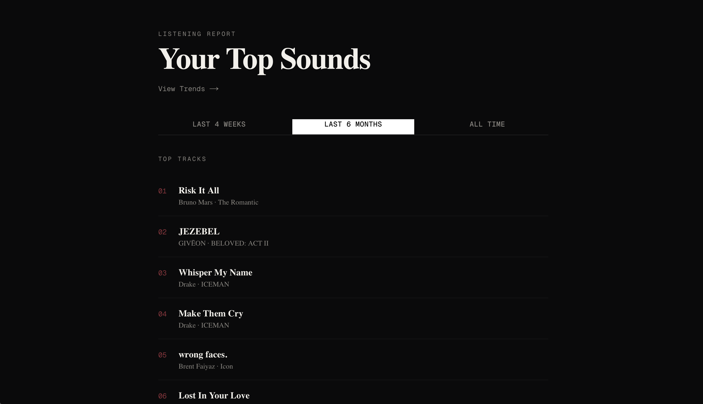
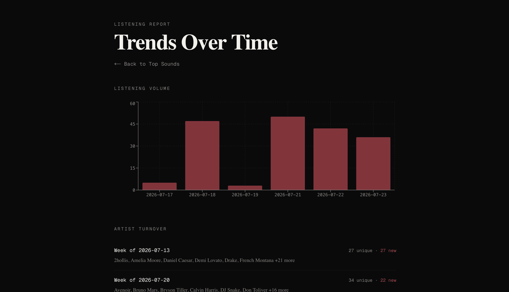

# Spotify Listening Trends Dashboard

A personal analytics dashboard that tracks how my Spotify listening habits change over time — something Spotify's own app and API don't surface, since the API only exposes a rolling last-50-tracks window with no historical depth.

**Live demo:** https://spotify-trends-dashboard.vercel.app
**API:** https://spotify-trends-dashboard-production.up.railway.app

---

## The problem

Spotify shows you your top tracks and artists, but not how that's *changed* — which artists are new this month, whether you're listening more or less than last week, how your taste is drifting. Spotify's API also doesn't retain history beyond the last 50 played tracks, so any "trends over time" feature has to build its own historical record from scratch.

## What this does

- **Top tracks & artists** across Spotify's three time ranges (last 4 weeks / 6 months / all time)
- **Listening volume over time** — a real chart, built from data this project collects itself
- **Artist turnover** — which artists are newly appearing in my listening history, week over week
- An automated background job snapshots my recently-played tracks every 30 minutes, independent of whether I'm using the app, building the historical dataset Spotify itself doesn't provide

## Architecture
┌─────────────┐ ┌──────────────┐ ┌─────────────┐
│ Next.js │────▶│ FastAPI │────▶│ Spotify API │
│ (Vercel) │ │ (Railway) │ │ │
└─────────────┘ └──────┬───────┘ └─────────────┘
│
▼
┌──────────────┐
│ Supabase │
│ (Postgres) │
└──────▲───────┘
│
┌──────┴───────┐
│ GitHub Actions│
│ (every 30 min)│
└──────────────┘

The frontend and backend are fully decoupled — the frontend only ever talks to the FastAPI backend over REST, never directly to Spotify or the database. A scheduled GitHub Actions job runs independently, authenticating via a token stored in the database (not a local file), so it can operate without any manual login step once set up.

## Tech stack

- **Backend:** Python, FastAPI, SQLAlchemy, `uv` for dependency management
- **Frontend:** Next.js (App Router), TypeScript, Tailwind CSS, shadcn/ui, Recharts
- **Database:** PostgreSQL via Supabase
- **Automation:** GitHub Actions (scheduled cron)
- **Deployment:** Vercel (frontend), Railway (backend)
- **Spotify integration:** Authorization Code OAuth flow via `spotipy`

## Screenshots

### Top Sounds


### Trends Over Time


## Known limitations

- **No genre data.** Spotify's API stopped returning genre information on artist objects (an undocumented change, not in their official changelog) partway through building this — confirmed by testing, not assumption. Genre-mix trends were scoped out as a result; artist turnover and listening volume remain as the two trend metrics.
- **Occasional token refresh race conditions.** Local dev, the production API, and the scheduled snapshot job all independently refresh the same stored Spotify token. Since Spotify rotates refresh tokens on use, concurrent refreshes from two sources can occasionally conflict, causing an isolated failed snapshot run. No data is lost — the next successful run picks up recent plays normally. A more robust fix would centralize token refresh through a single source or add locking.

## What I'd build next

- **Third-party genre data** — cross-referencing artist names against a source like MusicBrainz to restore genre-mix trends without relying on Spotify's API for it
- **Listening session clustering** — grouping snapshot data into distinct "sessions" (e.g., morning commute, evening wind-down) to surface listening patterns by time of day
- **Centralized token refresh** — resolving the race condition above properly, likely via a dedicated refresh endpoint that all consumers call instead of refreshing independently

## Running locally

```bash
# Backend
cd backend
uv sync
uv run uvicorn app.main:app --reload --port 8000

# Frontend (separate terminal)
cd frontend
npm install
npm run dev
```

Requires a `.env` file in the project root (see `.env.example`) with Spotify API credentials and a Postgres connection string.